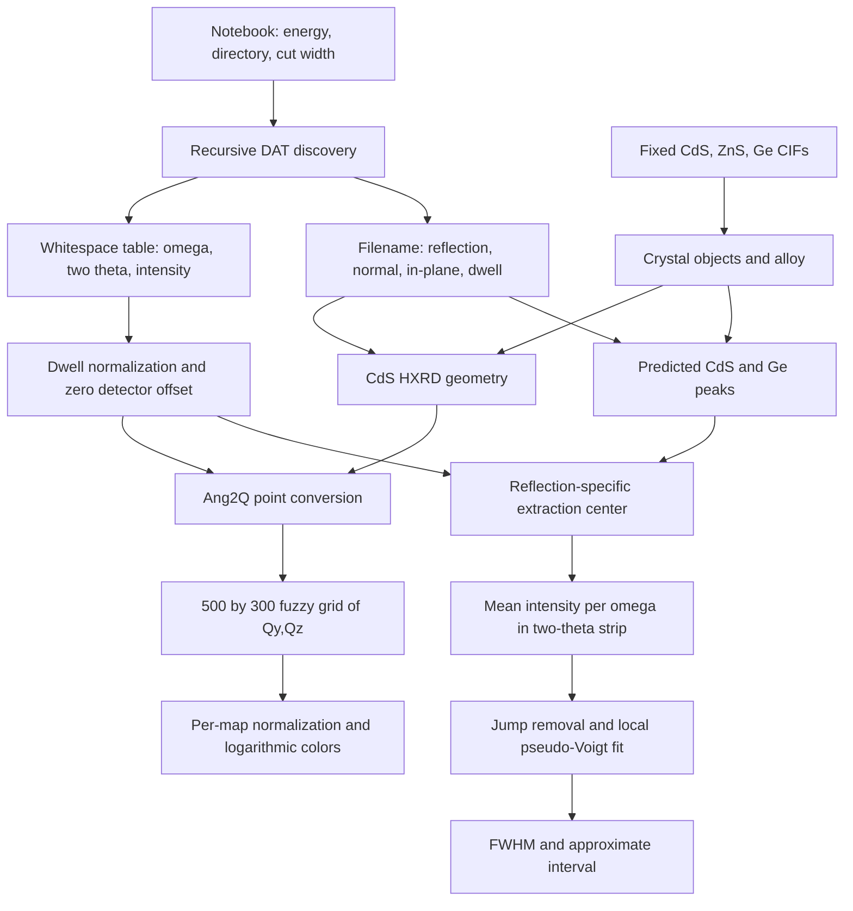

# Data pipeline and coupling

All steps below describe implementation, not endorsement of the physical interpretation.

## 1. Discovery and metadata

The main notebook selects [S0183/](../S0183/) and recursively finds `.dat` files ([notebook](../RSM_main.ipynb:47)). Absolute paths produced by this glob work with `data_folder / subfolder` because the absolute component replaces the prefix. A relative path already containing the data directory could instead duplicate that directory. There is no explicit ordering or filename collision check.

The filename is the configuration interface ([parser](../Modules/data_procesing.py:57)). Required tokens are `Mat`, `RSM`, `Norm`, `InPlane`. Optional `omoff=` defaults to zero and `int_...s` to one. For example the S0183 reflection becomes (2,2,0), the normal becomes (1,0,0), and `InPlane1-120` becomes (1,-1,0), with a warning because its discarded i=2 does not equal -(1-1)=0. The warning appears in the saved notebook ([line 65](../RSM_main.ipynb:65)). `Mat` returns material plus sample identifier, such as CdSS0183, and does not control material selection. `Temp`, sample ID and in-plane labels are reparsed independently for presentation.

## 2. Table parsing and intensity preparation

[initialize_data](../Modules/data_procesing.py:103) calls `pandas.read_csv(delimiter=r'\s+', decimal=',', engine='python', header=None)`. The expected semantic columns are:

| Column | Assigned variable | Intended unit | Evidence / uncertainty |
|---|---|---|---|
| 0 | om | degrees | Passed to HXRD with default angle-unit behavior; curve label says degrees |
| 1 | tt | degrees of 2theta | Used as second HXRD angle; no header confirms original instrument encoding |
| 2 | psd | intensity, then intensity / dwell | Assumed count-like quantity; supplied fractional values mean raw integer photon counts cannot be assumed |

Additional columns are ignored. Headers, comments, timestamps, detector calibration and per-point exposure are not supported explicitly. Only `tt_offset` is added, but title parsing sets it to zero. Parsed omega alignment offset is unused. Intensity is divided by one scalar dwell time; its presumed unit is seconds because the filename delimiter is `s` ([lines 64–65](../Modules/data_procesing.py:64)). None of the supplied filenames specifies dwell.

## 3. Crystals and angle conversion

[crystal_defenitions](../Modules/geometry.py:6) reads the fixed reference structures and creates a 0.35 alloy regardless of the sample. [make_geometry](../Modules/geometry.py:40) maps normal and in-plane indices through the selected material's reciprocal basis, then constructs HXRD. [initialize_data](../Modules/data_procesing.py:112) always selects CdS and calls `Ang2Q(om, tt)`; there is no channel-to-angle detector calibration in repository code.

The output contract is three dictionaries keyed by basename ([lines 119–123](../Modules/data_procesing.py:119)):

- `data_dict[key]`: list of three N-element arrays `[omega, two_theta, intensity/dwell]`.
- `converted_data_dict[key]`: 4×N array `[qx,qy,qz,intensity/dwell]`.
- `exp_geometry[key]`: three index triples `[reflection,normal,inplane]`.

There is no persistent record of parser settings, energy, original file path, offsets or dwell in those result objects. Identical basenames in separate directories overwrite silently.

## 4. Map representation

[plot_RSM](../Modules/plotting.py:43) allocates a reusable `FuzzyGridder2D(500,300)` and disables data accumulation with `KeepData(False)`. It bins point intensities versus qy and qz, transposes the grid for Matplotlib, divides by its maximum, floors at 0.1 divided by the original maximum, and produces 100 logarithmic contour levels ([lines 68–91](../Modules/plotting.py:68)). The color norm lower limit is ten times the contour floor. Exact fuzzy bin footprint, empty-bin treatment, averaging and axis-range reuse are delegated to the unpinned library and were not executable in this environment. Do not describe this as verified interpolation or flux-conserving resampling.

There is no logarithm of the data before fitting. Logarithmic contour spacing/color scaling applies only to map display. qx is retained during conversion but omitted from maps and theoretical-marker returns. `plot_space='Real'` changes strip-boundary coordinates but does not change the underlying reciprocal map, so it is not a working angular-map mode ([plotting line 68](../Modules/plotting.py:68), [line_scan line 15](../Modules/line_scan.py:15)). “Real” means angular here, not real-space position.

## 5. Peak selection and line extraction

For `20-20`, the code searches near a theoretical hex-Ge peak using `find_fixed_position`, passing omega and 2theta to functions named `get_qy_scan` and `get_qz_scan` ([plotting line 110](../Modules/plotting.py:110)). Thus constants 0.1 and 0.01 in that path operate on angle-valued coordinates, despite reciprocal-space names. This searches maxima, not center of mass. The separate thresholded centroid implementation is unused.

For `12-30`, the predicted Ge 2theta is used directly. Other reflections have no assignment to `com_tt_data`; when first in a call they fail, and after a supported reflection they can reuse its stale center. The two supplied S-series datasets use unsupported reflections.

[line_scan](../Modules/line_scan.py:41) selects points with `abs(tt-center)<=ttrange`, groups exact omega values, and averages intensity. This is not an integrated intensity with angular bin-width weighting. The notebook's half-width is 0.2°, giving a 0.4° strip ([notebook](../RSM_main.ipynb:101)). There is no background subtraction. Boundary curves in reciprocal space are generated from all raw omega entries, including duplicates ([line_scan line 12](../Modules/line_scan.py:12)).

The curve figure divides by `vmax`, but this is already 1 after map normalization for a finite positive map. Thus the label “Intensity / max substrate Intensity” is unsupported ([plotting lines 70–72](../Modules/plotting.py:70), [line 140](../Modules/plotting.py:140)).

## 6. Fit and final products

[fitting](../Modules/fitting.py:59) removes points whose jump from their preceding raw point exceeds 0.5, selects ±2° about the second-highest retained value, then fits a single common-FWHM pseudo-Voigt with no baseline. Unweighted bounded `curve_fit` provides parameters and covariance. Only FWHM and nominal 95% bounds are returned; center, amplitude, mixture, covariance, residuals and selection mask are discarded. The supplied theoretical CdS value does not constrain the fit; predicted Ge omega is annotation only.

The optional [temperature plot](../Modules/plotting.py:167) handles three fixed groups and is not called by the notebook. No function saves figures or numerical outputs to disk. Current products are in-memory figures and dictionaries, stdout, and whatever outputs the interactive notebook happened to retain.

## Coupling that a rebuild must understand

| Coupling | Scientific consequence | Source |
|---|---|---|
| Filename parsing ↔ plane/direction indexing | Text spelling selects orientation and reflection; malformed indices still propagate | [parser](../Modules/data_procesing.py:67) |
| Crystal choice ↔ measured geometry | CdS is required to convert every measurement even though scattering kinematics is sample independent once frame is defined | [conversion](../Modules/data_procesing.py:112) |
| Plotting ↔ peak search ↔ extraction | A display call fails because a reflection has no analysis branch; cannot simply draw arbitrary maps | [map](../Modules/plotting.py:110) |
| Display normalization ↔ fitting threshold | Misleading `vmax` feeds a fixed jump threshold; scale affects selected data | [fit wrapper](../Modules/fitting.py:45) |
| Theory ↔ sample identity | Material keys fixed, common index triples applied to separate crystal frames; no explicit epitaxial rotation | [experiments](../Modules/geometry.py:46) |
| Analysis ↔ GUI state | Fit results require figure objects; closed figures may be reactivated by number | [fitting](../Modules/fitting.py:105) |
| Import ↔ global state | Global Matplotlib styles and notebook-wide warning suppression | [styles](../Modules/plotting.py:13), [notebook](../RSM_main.ipynb:23) |
